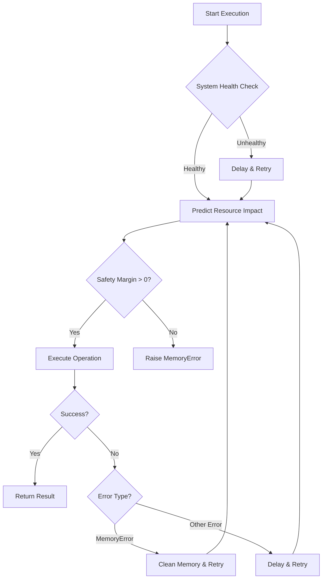

# Safe Execution Wrapper for Resource-Constrained Systems

## Key Safety Features

### 1. Multi-Layer Protection System
```python
def execute_safely(self, func, *args, **kwargs):
    # 1. Pre-execution system health check
    # 2. Resource impact prediction
    # 3. Safety margin verification
    # 4. Executor with automatic recording
    # 5. Retry mechanism with exponential backoff
    # 6. Specialized error handling
```

### 2. Intelligent Batch Processing
```python
def batch_executor(self, func, data, batch_size=None, operation_type="batch"):
    # Automatic batch sizing
    # Dynamic batch reduction during overload
    # Progress monitoring
    # Partial result preservation
```

### 3. Thermal Protection System
```python
def system_check(self):
    # Critical temperature monitoring
    if status['temperature'] > self.config['thermal_throttle_temp']:
        self.logger.error(f"Critical temperature: {status['temperature']}°C")
        return False
```

### 4. Memory Failure Recovery
```python
def _handle_memory_error(self, attempt):
    # Aggressive memory cleanup
    # Workload reduction
    # Exponential backoff delay
    # Precision reduction
```

### 5. Resource Throttling Decorator
```python
def resource_throttle(self, func):
    # Pauses execution during high CPU load
    # Blocks during memory pressure
    # Ensures safe execution conditions
```

## AMD Ryzen-Specific Optimizations

### 1. Temperature Management
```python
# In DEFAULT_CONFIG:
'thermal_throttle_temp': 85  # Ryzen 5 4600H throttling point
```

### 2. Core Utilization Limits
```python
# Respects 6-core/12-thread architecture
'max_workers': 6  # Use physical cores for computation
```

### 3. Cache-Aware Batch Processing
```python
# In enhanced_auto_batch_size:
# Includes cache behavior prediction for Ryzen's L3 cache
cache_impact = self.predictor.cache_behavior_model(pattern_size)
```

### 4. Precision Optimization
```python
# Automatic float32 → float16 downgrade
def _reduce_precision(self):
    # Preserves computation while reducing memory
```

## Usage Examples

### 1. Safe Single Execution
```python
with SafeExecutionWrapper() as wrapper:
    result = wrapper.execute_safely(
        expensive_operation,
        data,
        operation_type="pattern_recall",
        pattern_size=1000,
        n_patterns=50
    )
```

### 2. Batch Processing
```python
results = wrapper.batch_executor(
    process_data,
    dataset,
    operation_type="data_processing"
)
```

### 3. Resource-Throttled Functions
```python
@wrapper.resource_throttle
def critical_inversion(matrix):
    return np.linalg.inv(matrix)
```

### 4. Context Manager
```python
with SafeExecutionWrapper() as safe_env:
    # All operations within this block are protected
    safe_env.execute_safely(...)
    safe_env.batch_executor(...)
```

## Safety Mechanisms Workflow



## Recovery Strategies

1. **Memory Errors**:
   - Force garbage collection
   - Clear numpy cache
   - Reduce workload size
   - Increase retry delay exponentially

2. **Numerical Instability**:
   - Automatic precision reduction
   - Algorithmic fallbacks
   - Value clamping

3. **System Overload**:
   - Dynamic batch size reduction
   - CPU throttling
   - Memory pressure delays

4. **Thermal Emergencies**:
   - Immediate operation pause
   - Cool-down period
   - Logged alerts with temperature readings

## Logging and Monitoring

The wrapper provides detailed operational logs:
```
2023-11-15 15:30:45 - SafeExecutionWrapper - INFO - Safe execution environment activated
2023-11-15 15:30:46 - SafeExecutionWrapper - INFO - Operation impact prediction: 
    Current: 1250.25MB, Predicted: 780.50MB, Peak: 2100.75MB
2023-11-15 15:30:47 - SafeExecutionWrapper - INFO - Processing batch 1/5 (500/2500 items)
2023-11-15 15:30:52 - SafeExecutionWrapper - WARNING - CPU throttling active - waiting
2023-11-15 15:30:55 - SafeExecutionWrapper - INFO - Processing batch 2/5 (1000/2500 items)
...
2023-11-15 15:31:30 - SafeExecutionWrapper - INFO - Cleanup completed
```

## Benefits for Your System

1. **Crash Prevention**: Avoids OOM crashes through predictive memory management
2. **Thermal Safety**: Protects your Ryzen processor from overheating
3. **Graceful Degradation**: Automatically reduces workload during resource constraints
4. **Fault Recovery**: Multiple retry mechanisms with intelligent backoff
5. **Efficient Resource Use**: Maximizes throughput within 8GB RAM limits
6. **Operational Transparency**: Detailed logging for optimization and debugging

This implementation transforms your AMD Ryzen 5 system into a resilient computing platform capable of handling memory-intensive chaotic network experiments while maintaining system stability and data integrity.
